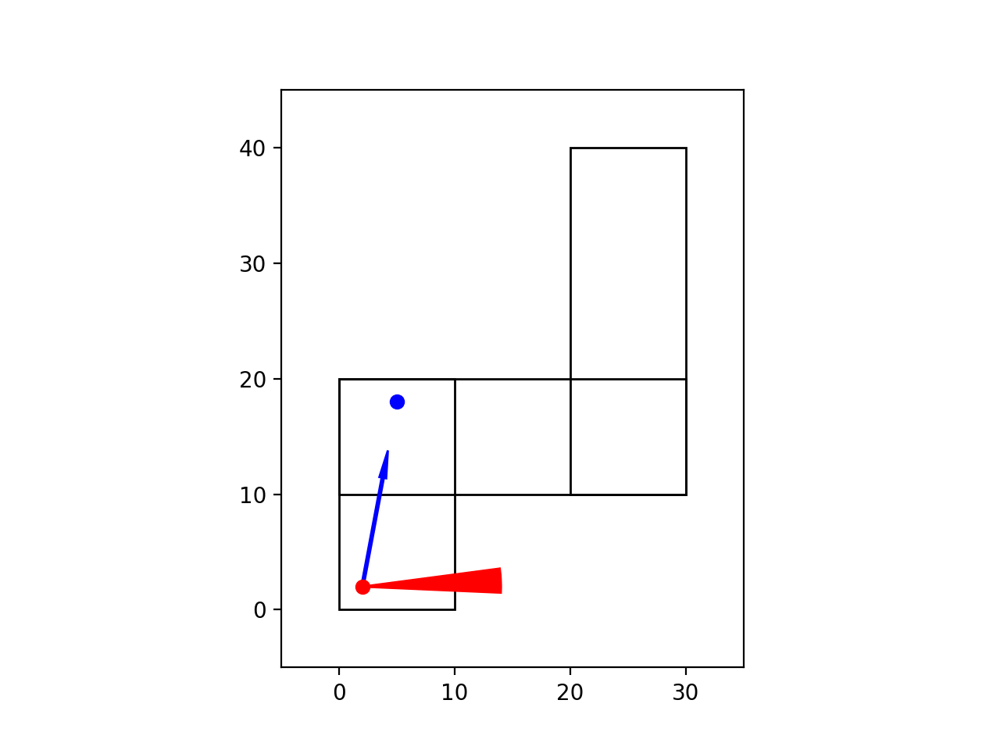

# BoxNav

A simple playground for making an agent navigate around some directed corridors represented as overlapping boxes.

## Getting Started in Unreal Engine

### Dependencies

Unreal Engine is needed for data collection, and you will want to either download our packaged simulation or the Unreal Engine 5 (UE) project from our shared Box folder. You will also need to install [ue5osc](https://github.com/arcslaboratory/OldenborgAutonomousNavigation/tree/main/ue5osc) using  instructions found in its README.

### Beginning the Simulation in UE5

Start the simulation by running the packaged simulation or pushing "play" inside the UE editor.

Then to kick off the simulation you must first ensure the following steps are followed:

1. If you do not have an Anaconda environment, create one with the following command (replace `ENVIRONMENT` with the name of your environment):

    ~~~bash
    conda create --name ENVIRONMENT
    conda activate ENVIRONMENT
    conda install python matplotlib celluloid
    cd ue5osc
    python -m pip install --editable .
    ~~~

2. On subsequent runs, you need only activate the environment:

    ~~~bash
    conda activate ENVIRONMENT
    ~~~

3. The script is now ready to run with the commands:

    ~~~bash
    # Runs the navigator in Python
    python boxsim.py NAVIGATOR

    # Runs the navigator in Python and generates an animated gif
    python boxsim.py NAVIGATOR --anim_ext gif

    # Runs the navigator in Python and UE (either the editor or packaged simulation)
    python boxsim.py NAVIGATOR --ue

    # Runs the navigator in Python and and UE, and save images to the specified path
    python boxsim.py NAVIGATOR --save_images 'PATH/TO/DATASET'

    # If desired, you can convert the images to a video using ffmpeg
    ffmpeg.exe -i "%03d.png" video.mp4
    ~~~

### Note about Command Line Arguments

The commands above showcase some examples as to how the script can be ran. Please look into the `boxsim.py` file for details over the arguments that can be passed.

### Notes about Unreal Engine

- In our packaged simulation you can add the following lines into the Game.ini file found in either:
  - MacOS: (Hidden folder) `\<Packaged_Game_Name>\Epic\ARCSAssets\Saved\Config\Mac`
  - Windows: `\<Packaged_Game_Name>\ARCSAssets\Saved\Config\Windows`

~~~ini
[/ARCSRobots/SimpleRobotCamera/BP_Pawn_SimpleRobotCamera.BP_Pawn_SimpleRobotCamera_C]
UEPort=UE_PORT
PyPort=PY_PORT
RobotVisible=ROBOT_VISIBLE
~~~

### Other Notes

Right-handed coordinate system.

- Up-Down is y relative to Oldenborg
- Left-right is x relative to Oldenborg
